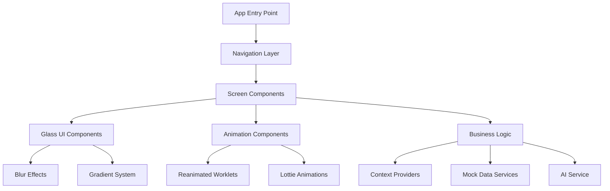

# Design Document

## Overview

This design document outlines the architecture and implementation approach for a modern food delivery app featuring glass morphism UI and smooth animations. The app will be built using React Native with Expo, leveraging React Native Reanimated for animations and Expo Blur for glass effects.

The application follows a modular architecture with clear separation of concerns, utilizing React Context for state management and mock data for demonstration purposes. The design prioritizes visual excellence, smooth 60 FPS animations, and an immersive user experience.

## Architecture

### High-Level Architecture



### Technology Stack

- **Framework**: React Native 0.81.4 with Expo ~54.0.9
- **Navigation**: Expo Router 6.0.7 with React Navigation
- **Animations**: React Native Reanimated 4.1.0 + React Native Worklets
- **Glass Effects**: Expo Blur + React Native Linear Gradient
- **State Management**: React Context API
- **Maps**: React Native Maps with custom styling
- **AI Integration**: OpenRouter.ai with Grok 4 Fast model
- **Icons**: Expo Vector Icons with custom animations
- **Gestures**: React Native Gesture Handler

### Project Structure

```
app/
├── (auth)/                 # Authentication screens
│   ├── onboarding.tsx
│   └── _layout.tsx
├── (main)/                 # Main app screens
│   ├── (tabs)/            # Tab navigation
│   │   ├── home.tsx
│   │   ├── search.tsx
│   │   ├── orders.tsx
│   │   └── profile.tsx
│   ├── restaurant/
│   │   ├── [id].tsx       # Restaurant detail
│   │   └── menu-item/[id].tsx
│   ├── cart.tsx
│   ├── checkout.tsx
│   ├── tracking.tsx
│   └── chat.tsx
├── _layout.tsx            # Root layout
└── +not-found.tsx

components/
├── glass/                 # Glass morphism components
│   ├── GlassContainer.tsx
│   ├── GlassCard.tsx
│   ├── GlassBottomSheet.tsx
│   └── GlassNavBar.tsx
├── animations/            # Animation components
│   ├── FadeInView.tsx
│   ├── ScaleButton.tsx
│   ├── ParallaxScrollView.tsx
│   └── FloatingElements.tsx
├── ui/                    # Base UI components
│   ├── Button.tsx
│   ├── Input.tsx
│   ├── Card.tsx
│   └── Modal.tsx
└── features/              # Feature-specific components
    ├── restaurant/
    ├── cart/
    ├── chat/
    └── maps/

services/
├── mockData.ts           # Mock data service
├── aiService.ts          # AI integration
├── locationService.ts    # Location utilities
└── animationService.ts   # Animation utilities

contexts/
├── AppContext.tsx        # Global app state
├── CartContext.tsx       # Cart management
├── UserContext.tsx       # User preferences
└── OrderContext.tsx      # Order tracking

constants/
├── theme.ts              # Design system
├── animations.ts         # Animation constants
└── mockData.ts          # Static mock data
```

## Components and Interfaces

### Glass Morphism System

#### GlassContainer Component

```typescript
interface GlassContainerProps {
  children: React.ReactNode;
  intensity?: number;        // Blur intensity (10-30)
  tint?: 'light' | 'dark' | 'default';
  borderRadius?: number;
  borderWidth?: number;
  style?: ViewStyle;
}

const GlassContainer: React.FC<GlassContainerProps> = ({
  children,
  intensity = 20,
  tint = 'light',
  borderRadius = 16,
  borderWidth = 1,
  style
}) => {
  return (
    <BlurView intensity={intensity} tint={tint} style={[glassStyles.container, style]}>
      <LinearGradient
        colors={getGradientColors(tint)}
        style={[glassStyles.gradient, { borderRadius, borderWidth }]}
      >
        {children}
      </LinearGradient>
    </BlurView>
  );
};
```

#### Glass Design System

```typescript
const glassTheme = {
  colors: {
    primary: '#FF6B35',
    secondary: '#2D3748',
    success: '#48BB78',
    background: {
      light: ['rgba(255,255,255,0.2)', 'rgba(255,255,255,0.05)'],
      dark: ['rgba(0,0,0,0.2)', 'rgba(0,0,0,0.05)'],
    },
    border: {
      light: 'rgba(255,255,255,0.2)',
      dark: 'rgba(255,255,255,0.1)',
    }
  },
  blur: {
    light: 20,
    medium: 25,
    heavy: 30,
  },
  shadows: {
    glass: {
      shadowColor: '#000',
      shadowOffset: { width: 0, height: 8 },
      shadowOpacity: 0.1,
      shadowRadius: 24,
      elevation: 8,
    }
  }
};
```

### Animation System

#### Animation Configuration

```typescript
const animationConfig = {
  durations: {
    fast: 200,
    normal: 300,
    slow: 500,
  },
  easing: {
    easeInOut: Easing.bezier(0.4, 0, 0.2, 1),
    spring: Easing.elastic(1.2),
    bounce: Easing.bounce,
  },
  transforms: {
    scale: {
      pressed: 0.95,
      hover: 1.05,
    },
    translate: {
      slideIn: 300,
      slideOut: -300,
    }
  }
};
```

#### Reanimated Worklets

```typescript
// Shared element transition worklet
const sharedElementTransition = (progress: SharedValue<number>) => {
  'worklet';
  return {
    transform: [
      {
        scale: interpolate(progress.value, [0, 1], [0.8, 1], Extrapolate.CLAMP)
      },
      {
        translateY: interpolate(progress.value, [0, 1], [50, 0], Extrapolate.CLAMP)
      }
    ],
    opacity: progress.value,
  };
};

// Parallax scroll worklet
const parallaxWorklet = (scrollY: SharedValue<number>, factor: number = 0.5) => {
  'worklet';
  return {
    transform: [
      {
        translateY: scrollY.value * factor
      }
    ]
  };
};
```

### Navigation Architecture

#### Screen Hierarchy

```typescript
// Root layout with glass theme provider
export default function RootLayout() {
  return (
    <GlassThemeProvider>
      <AppContextProvider>
        <Stack screenOptions={{ headerShown: false }}>
          <Stack.Screen name="(auth)" />
          <Stack.Screen name="(main)" />
        </Stack>
      </AppContextProvider>
    </GlassThemeProvider>
  );
}

// Main app navigation with custom transitions
const customTransition = {
  gestureDirection: 'horizontal',
  transitionSpec: {
    open: TransitionSpecs.TransitionIOSSpec,
    close: TransitionSpecs.TransitionIOSSpec,
  },
  cardStyleInterpolator: CardStyleInterpolators.forHorizontalIOS,
};
```

## Data Models

### Core Data Structures

```typescript
interface User {
  id: string;
  name: string;
  email: string;
  phone: string;
  preferences: {
    dietary: string[];
    cuisines: string[];
    spiceLevel: 'mild' | 'medium' | 'hot';
  };
  addresses: Address[];
  paymentMethods: PaymentMethod[];
}

interface Restaurant {
  id: string;
  name: string;
  description: string;
  image: string;
  rating: number;
  deliveryTime: string;
  deliveryFee: number;
  minimumOrder: number;
  cuisine: string[];
  isOpen: boolean;
  location: {
    latitude: number;
    longitude: number;
    address: string;
  };
  menu: MenuItem[];
}

interface MenuItem {
  id: string;
  name: string;
  description: string;
  price: number;
  image: string;
  category: string;
  dietary: string[];
  customizations: Customization[];
  isAvailable: boolean;
}

interface CartItem {
  menuItem: MenuItem;
  quantity: number;
  customizations: { [key: string]: string };
  totalPrice: number;
}

interface Order {
  id: string;
  userId: string;
  restaurantId: string;
  items: CartItem[];
  status: 'pending' | 'confirmed' | 'preparing' | 'out_for_delivery' | 'delivered';
  totalAmount: number;
  deliveryAddress: Address;
  estimatedDelivery: Date;
  driver?: Driver;
}
```

### State Management Architecture

```typescript
// App Context for global state
interface AppState {
  user: User | null;
  currentLocation: Location | null;
  theme: 'light' | 'dark';
  isLoading: boolean;
}

// Cart Context for shopping cart
interface CartState {
  items: CartItem[];
  restaurant: Restaurant | null;
  subtotal: number;
  deliveryFee: number;
  total: number;
}

// Order Context for order tracking
interface OrderState {
  currentOrder: Order | null;
  orderHistory: Order[];
  trackingData: TrackingData | null;
}
```

## Error Handling

### Error Boundaries and Fallbacks

```typescript
// Glass Error Boundary Component
class GlassErrorBoundary extends React.Component {
  render() {
    if (this.state.hasError) {
      return (
        <GlassContainer>
          <ErrorFallback 
            error={this.state.error}
            onRetry={() => this.setState({ hasError: false })}
          />
        </GlassContainer>
      );
    }
    return this.props.children;
  }
}

// Network Error Handling
const handleNetworkError = (error: Error) => {
  if (error.name === 'NetworkError') {
    showGlassToast({
      type: 'error',
      message: 'Connection lost. Please check your internet.',
      duration: 3000,
    });
  }
};
```

### AI Service Error Handling

```typescript
const aiService = {
  async getChatResponse(message: string): Promise<string> {
    try {
      const response = await fetch('/api/chat', {
        method: 'POST',
        body: JSON.stringify({ message }),
      });
      
      if (!response.ok) {
        throw new Error('AI service unavailable');
      }
      
      return await response.text();
    } catch (error) {
      // Fallback to predefined responses
      return getFallbackResponse(message);
    }
  }
};
```

## Testing Strategy

### Component Testing

```typescript
// Glass component testing
describe('GlassContainer', () => {
  it('should render with correct blur intensity', () => {
    const { getByTestId } = render(
      <GlassContainer intensity={25} testID="glass-container">
        <Text>Test Content</Text>
      </GlassContainer>
    );
    
    const blurView = getByTestId('glass-container');
    expect(blurView.props.intensity).toBe(25);
  });
});

// Animation testing
describe('ScaleButton', () => {
  it('should animate scale on press', async () => {
    const onPress = jest.fn();
    const { getByTestId } = render(
      <ScaleButton onPress={onPress} testID="scale-button">
        <Text>Press Me</Text>
      </ScaleButton>
    );
    
    const button = getByTestId('scale-button');
    fireEvent.press(button);
    
    // Test animation values
    await waitFor(() => {
      expect(onPress).toHaveBeenCalled();
    });
  });
});
```

### Performance Testing

```typescript
// Animation performance monitoring
const performanceMonitor = {
  trackFPS: () => {
    let lastTime = performance.now();
    let frameCount = 0;
    
    const measureFPS = () => {
      frameCount++;
      const currentTime = performance.now();
      
      if (currentTime - lastTime >= 1000) {
        const fps = frameCount;
        console.log(`FPS: ${fps}`);
        
        if (fps < 55) {
          console.warn('Performance warning: FPS below 55');
        }
        
        frameCount = 0;
        lastTime = currentTime;
      }
      
      requestAnimationFrame(measureFPS);
    };
    
    measureFPS();
  }
};
```

### Integration Testing

```typescript
// End-to-end user flow testing
describe('Order Flow', () => {
  it('should complete full order process', async () => {
    // Navigate to restaurant
    await navigateToRestaurant('restaurant-1');
    
    // Add items to cart
    await addItemToCart('item-1');
    
    // Proceed to checkout
    await navigateToCheckout();
    
    // Complete order
    await completeOrder();
    
    // Verify order tracking
    expect(screen.getByText('Order Confirmed')).toBeTruthy();
  });
});
```

## Performance Optimization

### Animation Optimization

```typescript
// Optimized animation hooks
const useOptimizedAnimation = (config: AnimationConfig) => {
  const animatedValue = useSharedValue(0);
  
  const startAnimation = useCallback(() => {
    animatedValue.value = withSpring(1, {
      damping: 15,
      stiffness: 150,
      mass: 1,
    });
  }, []);
  
  const resetAnimation = useCallback(() => {
    animatedValue.value = withTiming(0, { duration: 200 });
  }, []);
  
  return { animatedValue, startAnimation, resetAnimation };
};
```

### Memory Management

```typescript
// Cleanup utilities for animations
const useAnimationCleanup = () => {
  const animationsRef = useRef<Set<any>>(new Set());
  
  const registerAnimation = useCallback((animation: any) => {
    animationsRef.current.add(animation);
  }, []);
  
  useEffect(() => {
    return () => {
      // Cleanup all registered animations
      animationsRef.current.forEach(animation => {
        if (animation.cancel) {
          animation.cancel();
        }
      });
      animationsRef.current.clear();
    };
  }, []);
  
  return { registerAnimation };
};
```

This design document provides a comprehensive foundation for implementing the glass morphism food delivery app with all the required features, animations, and technical specifications outlined in the requirements.